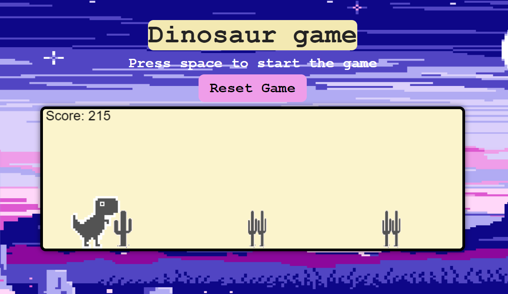

# kreativstorm-project3-game


  - [Overview](#overview)
  - [The Project](#the-project)
  - [Screenshot](#screenshot)
  - [Links](#links)
  - [Screenshots](#screenshots) 
  - [Built with](#built-with)
  - [What we learned](#what-we-learned)
  - [Problems we faced](#problems-we-faced)
  - [Useful resources](#useful-resources)

## Overview


### The Project
We created a javascript game called Dinosaur game using HTML, CSS and JavaScript. The game is a simple game where the player has to jump over obstacles to avoid them. The dinosaur has to jump over the cacti to avoid them. The game was built using HTML, CSS and JavaScript.

### Links

- Solution URL: [Github repo](https://github.com/elic4vet/kreativstorm-project3-game)
- Live Site URL: [Live Demo](https://elic4vet.github.io/kreativstorm-project3-game/)

### Screenshots
Computer view :




### Built with
-HTML

-CSS

-JavaScript

### What we learned
We learned how to create a simple game using HTML, CSS and JavaScript. We also learned how to make the game responsive using media queries. Some of the things we learned include:
 - Javascript functions, loops and conditional statements
 - Media queries
 - Velocity and acceleration
 - Dimensions and positioning

Some code snippets :

```js
function updateCacti() {
    if (!gameStarted) {
        return;
    }

    for (let i = 0; i < cacti.length; i++) {
        let cactus = cacti[i];
        cactus.x += horizontalVelocity;
        drawImage(cactus.image, cactus.x, cactus.y, cactus.width, cactus.height);

        if (dino.x > cactus.x + cactus.width) {
            cactus.passed = true;
        }

        if (detectCollision(dino, cactus)) {
            gameover = true;
            drawImage(dinoDeadImg, dino.x, dino.y, dino.width, dino.height);
        }
    }
}
```

```js
function updateDino() {
    dino.velocity += gravity;
    dino.y += dino.velocity;

    if (dino.y > boardHeight - dinoHeight) {
        dino.y = boardHeight - dinoHeight;
        dino.velocity = 0;
    }

    drawImage(dinoImg, dino.x, dino.y, dino.width, dino.height);
}
```

### Problems we faced
 - We faced some problems with the collision detection and the game over screen. 
 - We also had some issues with the game speed and the scoring speed
 - One of the biggest challenges was to make control the jump of the dinosaur and the speed of the game

### Useful resources
- [Coordinates](https://javascript.info/coordinates) - This helped us to understand the concepts of JavaScript and how to use it. It also helped us to understand the concepts of game development.
- [Animations in Javascript ](https://javascript.info/js-animation) - This is an amazing article which helped us finally understand how to use animations in JavaScript. I'd recommend it to anyone still learning this concept.